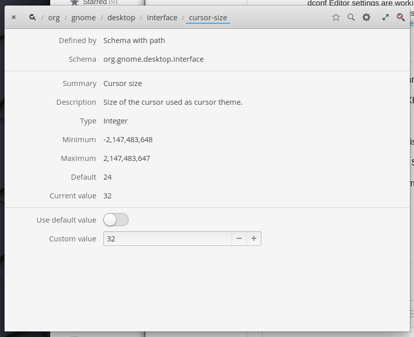

# ElementaryOS Tweaks

Add PPA Support
```
sudo apt install software-properties-common
```

Install Elementary Tweaks
```
sudo add-apt-repository ppa:philip.scott/elementary-tweaks
sudo apt update
sudo apt install elementary-tweaks
```

Change Cursor Size in Dconf



Change Scaling in Dconf ("1.21" for laptop and "1" for monitor)


