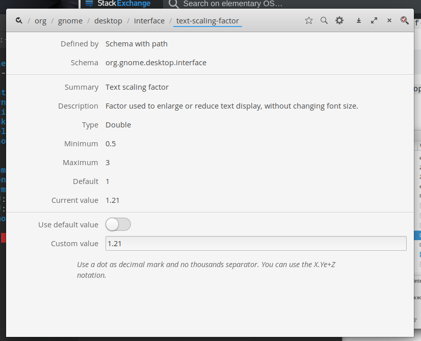
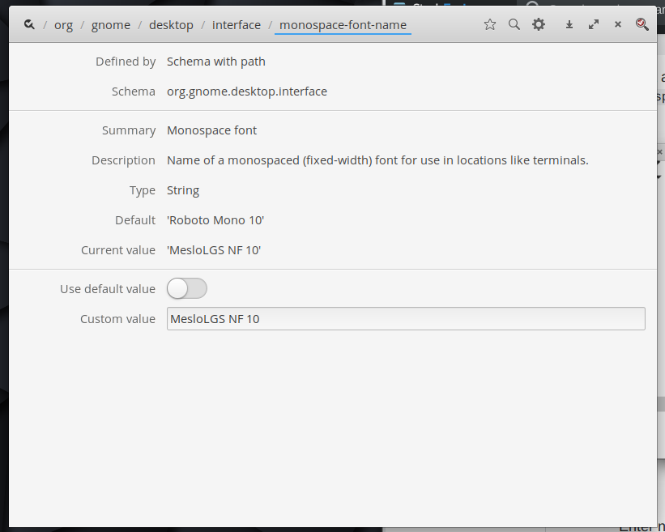

# ElementaryOS Tweaks and Setup

#### Add PPA Support
```
sudo apt install software-properties-common
```

Install Elementary Tweaks
```
sudo add-apt-repository ppa:philip.scott/elementary-tweaks
sudo apt update
sudo apt install elementary-tweaks
```

Install fonts in the Fonts folder to system

Install AppImage Launcher
```
https://github.com/TheAssassin/AppImageLauncher/releases

Download and install the .deb file
```

AppImages to Download
```
Balena Etcher
Flameshot
```

Libunput Setup and Gestures Install
```
sudo gpasswd -a $USER input
## Logout for changes to take effect
sudo apt-get install libinput-tools

Installation
git clone https://github.com/bulletmark/libinput-gestures.git
cd libinput-gestures
sudo make install (or sudo ./libinput-gestures-setup install)

Configuration
libinput-gestures-setup autostart
libinput-gestures-setup start

Gestures GUI Install
sudo apt install python3 python3-setuptools xdotool python3-gi libinput-tools python-gobject

Installationgit clone https://gitlab.com/cunidev/gestures
cd gestures
sudo python3 setup.py install
git clone https://gitlab.com/cunidev/gestures
cd gestures
sudo python3 setup.py install

```

Libinput Swipe Gestures

```
# Gestures
# Swipe to the Next Broswer Page
gesture swipe right 3 xdotool key alt+Right

# Swipe to the Previous Browser Page
gesture swipe left 3 xdotool key alt+Left

# Show all Apps Open in all Workspaces
gesture swipe up 3 xdotool key Super+a

# Show Apps Opein in current Workspace
gesture swipe down 3 xdotool key Super+Down

# Swipe to the Next Workspace
gesture swipe right 4 xdotool key Super+Right

# Swipe to the Previous Workspace
gesture swipe left 4 xdotool key Super+Left
```

Solution if System Hangs While Shutting Down

Run this command
```
sudo io.elementary.code /etc/systemd/system.conf
```
Delete the # in front of the the two lines below and change the 90s to something lower. I've set mine to 6s and my system shuts down very quickly.
```
DefaultTimeoutStartSec=9s
DefaultTimeoutStopSec=9s
```

Change Cursor Size in Dconf


Change Scaling in Dconf ("1.21" for laptop and "1" for monitor)



Change Default Therminal when using Nemo


Change Elementary OS Terminal Font



Enable "Play" Media Key"


